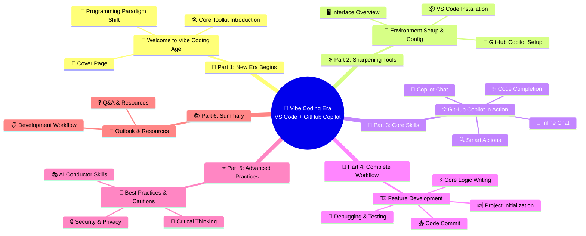
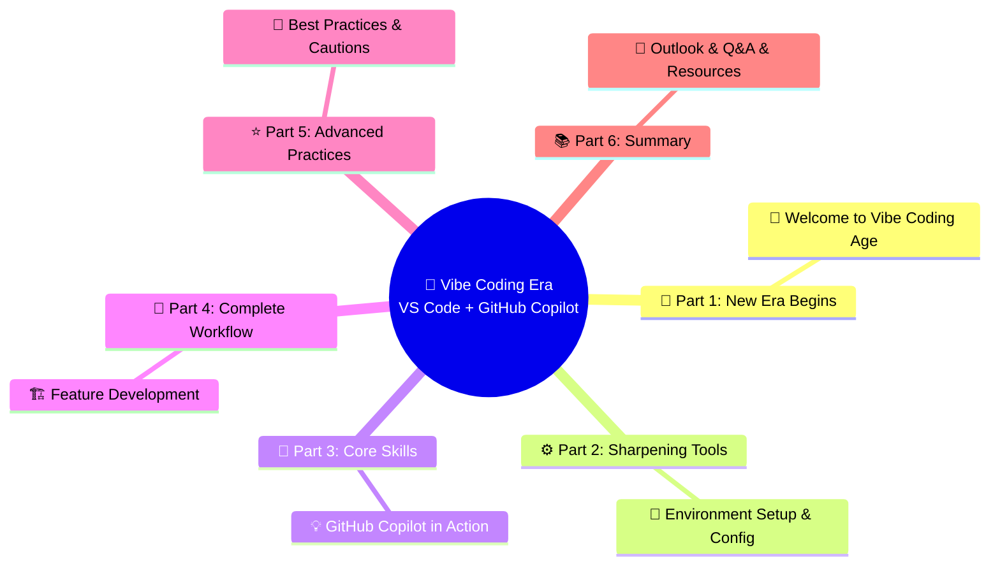

# Vibe Coding Training Slides Structure Mindmap

This document visualizes the structure of the "Vibe Coding Era: Ignite Your Developer Superpowers with VS Code + GitHub Copilot" training slides using a modern Mermaid mindmap.

## 📊 Slides Structure Overview

## 🎨 Design Philosophy

This mindmap reflects the training's progressive structure:

- **🌟 Mindset Shift**: Introducing the new paradigm
- **⚙️ Preparation**: Setting up the essential tools
- **🎯 Hands-on Practice**: Core skills development
- **🔄 Real-world Application**: Complete workflow demonstration
- **⭐ Mastery**: Advanced practices and best practices
- **📚 Continuous Learning**: Summary and future direction

## 📖 Usage

This visualization helps trainers and learners understand the logical flow and relationship between different training modules, ensuring a comprehensive learning journey from concept to mastery.
