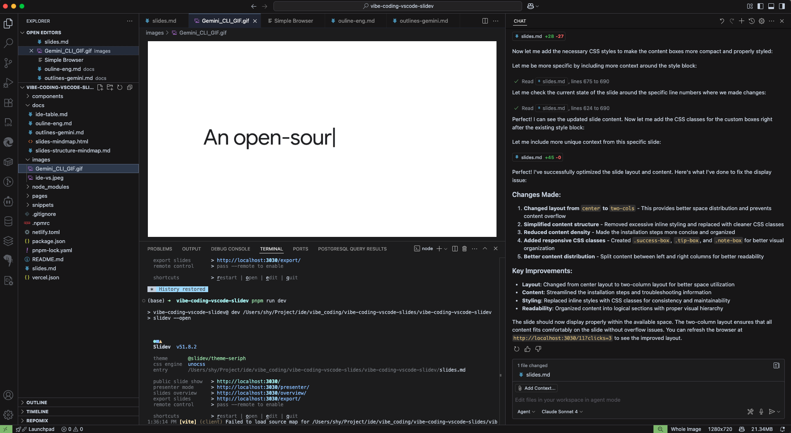

---
# You can also start simply with 'default'
theme: seriph
# random image from a curated Unsplash collection by Anthony
# like them? see https://unsplash.com/collections/94734566/slidev
background: https://cover.sli.dev
# some information about your slides (markdown enabled)
title: The Vibe Coding Era
info: |
  ## Slidev Starter Template
  Presentation slides for developers.

  Learn more at [Sli.dev](https://sli.dev)
# apply unocss classes to the current slide
class: text-center
# https://sli.dev/features/drawing
drawings:
  persist: false
# slide transition: https://sli.dev/guide/animations.html#slide-transitions
transition: slide-left
# enable MDC Syntax: https://sli.dev/features/mdc
mdc: true
# 引入全局样式文件来调整标题字体大小
css: style.css
# open graph
# seoMeta:
#  ogImage: https://cover.sli.dev
---

# The Vibe Coding Era: Ignite Your Developer Superpowers with VS Code + GitHub Copilot

Target Audience: Programming beginners, new developers, engineers looking to embrace the AI programming paradigm.

**A Practical Guide for New Developers to Get Started Quickly**


<div @click="$slidev.nav.next" class="mt-12 py-1" hover:bg="white op-10">
  Press Space for next page <carbon:arrow-right />
</div>

<div class="abs-br m-6 text-xl">
  <button @click="$slidev.nav.openInEditor()" title="Open in Editor" class="slidev-icon-btn">
    <carbon:edit />
  </button>
  <a href="https://github.com/slidevjs/slidev" target="_blank" class="slidev-icon-btn">
    <carbon:logo-github />
  </a>
</div>

<!--
The last comment block of each slide will be treated as slide notes. It will be visible and editable in Presenter Mode along with the slide. [Read more in the docs](https://sli.dev/guide/syntax.html#notes)
-->

---
transition: fade-out
level: 2
---

# Training Objectives:

Slidev is a slides maker and presenter designed for developers, consist of the following features

1. Understand the new "Vibe Coding" paradigm.
2. Master the setup and use of VS Code as a modern development environment.
3. Grasp the core features of GitHub Copilot and integrate it into daily development workflows.
4. Learn how to collaborate efficiently with AI to accelerate onboarding and boost productivity.
5. Establish best practices and security awareness for programming in the AI era.
<br>
<br>

Read more about [Vibe Coding - A Modern Developer's Guide to IDE Mastery with AI](https://3hen1.github.io/vibe-code-docs/)

<!--
You can have `style` tag in markdown to override the style for the current page.
Learn more: https://sli.dev/features/slide-scope-style
-->

<style>
h1 {
  background-color: #2B90B6;
  background-image: linear-gradient(45deg, #4EC5D4 10%, #146b8c 20%);
  background-size: 100%;
  -webkit-background-clip: text;
  -moz-background-clip: text;
  -webkit-text-fill-color: transparent;
  -moz-text-fill-color: transparent;
}
</style>

<!--
Here is another comment.
-->

---
transition: slide-up
level: 2
---

# Navigation

Hover on the bottom-left corner to see the navigation's controls panel, [learn more](https://sli.dev/guide/ui#navigation-bar)

### Keyboard Shortcuts

|                                                     |                             |
| --------------------------------------------------- | --------------------------- |
| <kbd>right</kbd> / <kbd>space</kbd>                 | next animation or slide     |
| <kbd>left</kbd>  / <kbd>shift</kbd><kbd>space</kbd> | previous animation or slide |
| <kbd>up</kbd>                                       | previous slide              |
| <kbd>down</kbd>                                     | next slide                  |

<!-- https://sli.dev/guide/animations.html#click-animation -->

<p v-after class="absolute bottom-23 left-45 opacity-30 transform -rotate-10">Here!</p>

<style>
h1 {
  background-color: #2B90B6;
  background-image: linear-gradient(45deg, #4EC5D4 10%, #146b8c 20%);
  background-size: 100%;
  -webkit-background-clip: text;
  -moz-background-clip: text;
  -webkit-text-fill-color: transparent;
  -moz-text-fill-color: transparent;
}
</style>


---
layout: two-cols
layoutClass: gap-16
level: 2
---

# Table of contents

### 🚀  

    🌟 Part 1: New Era Begins
      💫 Welcome to Vibe Coding Age
    ⚙️ Part 2: Sharpening Tools
      🔧 Environment Setup & Config
    🎯 Part 3: Core Skills
      💡 GitHub Copilot in Action
    🔄 Part 4: Complete Workflow
      🏗️ Feature Development
    ⭐ Part 5: Advanced Practices
      🎨 Best Practices & Cautions
    📚 Part 6: Summary
      🎊 Outlook & Q&A & Resources

::right::

<Toc text-sm minDepth="1" maxDepth="2" />

---
layout: two-cols
layoutClass: gap-16
level: 2
title: Where Are We? The Shift in Programming Paradigms
---

### The Old Era (“Grind Coding”):

* Focused on syntax details and memorizing APIs.
* Writing lots of boilerplate code.
* Struggling through Stack Overflow and documentation.

::right::

### The New Era (“Vibe Coding”):

* **Core Concept:** Express intent, not line-by-line implementation (Intent over Implementation).
* AI as your pair programmer.
* Developers as "conductors," AI as the "orchestra."
* **Goal:** Faster, more focused, and more creative development.

<style>
h3 {
  background-color: #2B90B6;
  background-image: linear-gradient(45deg, #4EC5D4 10%, #146b8c 20%);
  background-size: 100%;
  -webkit-background-clip: text;
  -moz-background-clip: text;
  -webkit-text-fill-color: transparent;
  -moz-text-fill-color: transparent;
}
</style>

---
level: 2
---

# Our Core Toolkit

*   **VS Code: Your Modern Digital Workbench**
    *   More than just a text editor—it's a powerful, extensible development platform.
*   **GitHub Copilot: Your AI Coding Partner**
    *   Understands your context, autocompletes code, generates functions, writes tests, and even chats with you.
*   **Synergy:** Combining both creates an immersive, intelligent coding flow.

<style>
h1 {  
  background-color: #2B90B6;
  background-image: linear-gradient(45deg, #4EC5D4 10%, #146b8c 20%);
  background-size: 100%;
  -webkit-background-clip: text;
  -moz-background-clip: text;
  -webkit-text-fill-color: transparent;
  -moz-text-fill-color: transparent;
}
</style>

---
level: 2
title: How Code Editors See Each Other
class: editor-comparison-slide
---

# How Code Editors See Each Other

<div class="editor-table-container">
  <table class="editor-comparison-table">
    <thead>
      <tr>
        <th>Viewer \ Editor</th>
        <th>Notepad</th>
        <th>VIM</th>
        <th>Emacs</th>
        <th>Eclipse</th>
        <th>Visual Studio</th>
        <th>IntelliJ IDEA</th>
        <th>SublimeText</th>
        <th>VS Code</th>
        <th>Cursor</th>
        <th>Windsurf</th>
        <th>Claude Code</th>
      </tr>
    </thead>
    <tbody>
      <tr>
        <td class="editor-name">Notepad</td>
        <td>🤗 I'm Microsoft's golden child</td>
        <td>📖 You're just Linux's pre-installed text editor</td>
        <td>🔲 A Lisp-powered prosthetic arm from 1985</td>
        <td>💔 Java's hospice care</td>
        <td>😳 Call me granddaddy</td>
        <td>🚀 Rocket-boosted calculator</td>
        <td>💰 Paid version of me</td>
        <td>🤡 Bow down to the OG</td>
        <td>💀 Unemployed code generator</td>
        <td>🏄 A surfboard pretending to be an editor</td>
        <td>🕸️ Doesn't even have a GUI</td>
      </tr>
      <tr>
        <td class="editor-name">VIM</td>
        <td>🦀 A typewriter for monkeys</td>
        <td>☯️ Training ground for the right hand of God</td>
        <td>🤢 Terminal-stage key binding cancer</td>
        <td>🐭 Concentration camp for mouse slaves</td>
        <td>👹 Memory-guzzling monster</td>
        <td>🐘 Java elephant farm</td>
        <td>🍭 Colorful candy wrapper</td>
        <td>🔯 Disney disco ball editor</td>
        <td>🔮 Fortune-telling autocomplete</td>
        <td>🦓 The new circus act</td>
        <td>🎹 We both run in the terminal, bro</td>
      </tr>
      <tr>
        <td class="editor-name">Emacs</td>
        <td>🍴 Not GNU, not free at all</td>
        <td>🤏 You think you're worthy of the gods?</td>
        <td>➕ An OS disguised as an editor. I am God.</td>
        <td>🤢 Eclipse? More like sunset.</td>
        <td>🤮 Microsoft's tax collector</td>
        <td>💡 People with *real* ideas don't use you.</td>
        <td>🤢 Failed to challenge VS Code</td>
        <td>🔨 Microsoft's hammer and nail</td>
        <td>🗿 VS Code knockoff</td>
        <td>🗿 VS Code knockoff</td>
        <td>😡 Watch out, it might run `rm -f`</td>
      </tr>
      <tr>
        <td class="editor-name">Eclipse</td>
        <td>🤷 Try setting up Spring with this thing.</td>
        <td>⚠ For editing code on a live server.</td>
        <td>👴 A retirement home for old-timers.</td>
        <td>☕️ The de facto standard for Java.</td>
        <td>🐶 Can't stand that dog C#.</td>
        <td>🤑 The lure of capitalism.</td>
        <td>🗃️ For the occasional XML edit.</td>
        <td>⚡ To write Java, first install 10GB of plugins.</td>
        <td>⛓️ It totally messed up my Hibernate config.</td>
        <td>⛓️ It totally messed up my Struts config.</td>
        <td>🤔 Let me quiz you, how many ways can you write reflection?</td>
      </tr>
      <tr>
        <td class="editor-name">Visual Studio</td>
        <td>🗒️ A temporary scratchpad.</td>
        <td>👨‍🔧 A tool of medieval sorcery.</td>
        <td>⚛️ My performance analyzer is a paid feature!</td>
        <td>🐕 Can't stand that dog Java.</td>
        <td>👑 The GOAT (self-proclaimed).</td>
        <td>🤔 A worthy rival.</td>
        <td>🤷 My little bro VS Code can take you out easily.</td>
        <td>🐴 My vanguard.</td>
        <td>🧑‍🔧 Kid, try writing two lines of C++.</td>
        <td>🧑‍🔧 Kid, try writing two lines of C++.</td>
        <td>🤡 How dare you compare to me without "Visual" in your name?</td>
      </tr>
      <tr>
        <td class="editor-name">IntelliJ IDEA</td>
        <td>🧻 Caveman's toilet paper.</td>
        <td>🖐️ Finger gymnastics torture device.</td>
        <td>📰 Reverse Polish notation generator.</td>
        <td>🧟 Java zombie resurrector.</td>
        <td>🧐 Hmph, you cost more than me.</td>
        <td>👑 They don't call it the "Ultimate Pack" for nothing.</td>
        <td>😂 Just a smooth-running Notepad.</td>
        <td>😎 A practice tool for interns.</td>
        <td>🤨 Niche! Do you even know what an IDE is?!</td>
        <td>🤨 Niche! Do you even know what an IDE is?!</td>
        <td>🤖 The DALL·E for code.</td>
      </tr>
      <tr>
        <td class="editor-name">SublimeText</td>
        <td>📋 A colorful sticky note.</td>
        <td>🧛 Spartan warrior training camp.</td>
        <td>⏳ Time capsule editor.</td>
        <td>🧊 A frozen Java glacier.</td>
        <td>🏢 A reinforced concrete IDE.</td>
        <td>🐌 Snail launcher.</td>
        <td></td>
        <td>⚡ The Flash's sword.</td>
        <td>🔌 Plugin circus.</td>
        <td>🪄 Harry Potter's wand.</td>
        <td>📜 Spell generator.</td>
      </tr>
      <tr>
        <td class="editor-name">VS Code</td>
        <td>📠 An unplugged typewriter.</td>
        <td>⛰️ A caveman's tool.</td>
        <td>📺 An antique radio OS.</td>
        <td>👴 An old-fashioned Java tractor.</td>
        <td>🐘 A Titanic-sized IDE.</td>
        <td>👵 A senile Java IDE.</td>
        <td>😽 A has-been, paid-for pretty face.</td>
        <td>🌍 The center of the plugin universe.</td>
        <td>🍴 A zombie autocompleter.</td>
        <td>👣 Flipper-powered coding.</td>
        <td>💬 A chatty AI assistant.</td>
      </tr>
      <tr>
        <td class="editor-name">Cursor</td>
        <td>🔥 A flint toolkit.</td>
        <td>🐑 A sheepskin scroll editor.</td>
        <td>🧪 A test tube distillation editor.</td>
        <td>🌋 A dinosaur cloning experiment.</td>
        <td>🤑 A LEGO block IDE.</td>
        <td>🤡 A traditional craftsman.</td>
        <td>🪖 A cold weapon warrior.</td>
        <td>👩‍❤️‍💋‍👩 The perfect foundation for me.</td>
        <td>✨ That's me, with a $300M annual revenue!</td>
        <td>🗣️ Heard you can't even use Claude?</td>
        <td>👯‍♀️ Anthropic's big brother.</td>
      </tr>
      <tr>
        <td class="editor-name">Windsurf</td>
        <td>⛵ A canoe paddleboard.</td>
        <td>🚢 A rusty ship anchor editor.</td>
        <td>🧭 Compass-navigated coding.</td>
        <td>🐲 A tornado development pod.</td>
        <td>✈️ Space shuttle wreckage.</td>
        <td>🏢 A dinosaur in a skyscraper.</td>
        <td>📦 An arctic text refrigerator.</td>
        <td>🥰 Thanks for the plugins.</td>
        <td>🙏 I have daddy OpenAI.</td>
        <td>🌊 The driver of the code wave.</td>
        <td>👻 Stingy ghost.</td>
      </tr>
      <tr>
        <td class="editor-name">Claude Code</td>
        <td>🗿 A Moai statue editor.</td>
        <td>🤡 A failed Turing test subject.</td>
        <td>🧴 A genie-in-a-bottle OS.</td>
        <td>⚗️ Petri dish Java.</td>
        <td>⚰️ A mobster's toolkit in a suit.</td>
        <td>🤖 An AI-impaired calculator.</td>
        <td>🧊 A frozen codebase.</td>
        <td>🧪 Open-source experimental waste.</td>
        <td>🤝 Just pay up.</td>
        <td>🖕 I'm not letting you use me, deal with it.</td>
        <td>👑 The true AI savior.</td>
      </tr>
    </tbody>
  </table>
</div>

<style>
.editor-table-container {
  width: 100%;
  height: 100%;
  overflow: auto;
  padding: 10px;
  box-sizing: border-box;
}

.editor-comparison-table {
  width: 100%;
  border-collapse: collapse;
  font-size: 0.6rem;
  line-height: 1.2;
  table-layout: fixed;
}

.editor-comparison-table th,
.editor-comparison-table td {
  border: 1px solid #ddd;
  padding: 4px 6px;
  text-align: left;
  vertical-align: top;
  word-wrap: break-word;
  overflow-wrap: break-word;
  hyphens: auto;
}

.editor-comparison-table th {
  background-color: #f5f5f5;
  font-weight: bold;
  font-size: 0.55rem;
  position: sticky;
  top: 0;
  z-index: 10;
}

.editor-comparison-table th:first-child {
  width: 8%;
  min-width: 80px;
}

.editor-comparison-table th:not(:first-child) {
  width: 8.36%;
  min-width: 70px;
}

.editor-name {
  font-weight: bold;
  background-color: #f9f9f9;
  position: sticky;
  left: 0;
  z-index: 5;
}

.editor-comparison-table td {
  font-size: 0.55rem;
  max-width: 120px;
}

/* 响应式设计 */
@media (max-width: 1200px) {
  .editor-comparison-table {
    font-size: 0.5rem;
  }
  
  .editor-comparison-table th,
  .editor-comparison-table td {
    padding: 3px 4px;
    font-size: 0.48rem;
  }
}

@media (max-width: 900px) {
  .editor-comparison-table {
    font-size: 0.45rem;
  }
  
  .editor-comparison-table th,
  .editor-comparison-table td {
    padding: 2px 3px;
    font-size: 0.42rem;
  }
}

/* 斑马条纹效果 */
.editor-comparison-table tbody tr:nth-child(even) {
  background-color: #f8f9fa;
}

.editor-comparison-table tbody tr:hover {
  background-color: #e8f4f8;
}

/* 滚动条样式 */
.editor-table-container::-webkit-scrollbar {
  width: 8px;
  height: 8px;
}

.editor-table-container::-webkit-scrollbar-track {
  background: #f1f1f1;
  border-radius: 4px;
}

.editor-table-container::-webkit-scrollbar-thumb {
  background: #888;
  border-radius: 4px;
}

.editor-table-container::-webkit-scrollbar-thumb:hover {
  background: #555;
}
</style>


---
level: 2
layout: center
class: text-center
---

# Gemini CLI

<div class="flex justify-center items-center h-full">
  
</div>

<style>
.slidev-layout {
  padding: 2rem;
}

h1 {
  background-color: #2B90B6;
  background-image: linear-gradient(45deg, #4EC5D4 10%, #146b8c 20%);
  background-size: 100%;
  -webkit-background-clip: text;
  -moz-background-clip: text;
  -webkit-text-fill-color: transparent;
  -moz-text-fill-color: transparent;
  margin-bottom: 2rem;
}
</style>

---
layout: section
level: 1
title: Part 2 - Sharpening Your Tools
---

# Part 2: Sharpening Your Tools
## Environment Setup & Configuration

<div class="text-center mt-8">
  <div class="text-lg opacity-70">Let's prepare your development environment</div>
</div>

<style>
h1 {
  background-color: #2B90B6;
  background-image: linear-gradient(45deg, #4EC5D4 10%, #146b8c 20%);
  background-size: 100%;
  -webkit-background-clip: text;
  -moz-background-clip: text;
  -webkit-text-fill-color: transparent;
  -moz-text-fill-color: transparent;
}
</style>

---
layout: two-cols
layoutClass: gap-16
level: 2
title: Step 1 – Installing and Configuring VS Code
---

# Step 1 – Installing and Configuring VS Code

### Download & Install
* Download from the official website: [code.visualstudio.com](https://code.visualstudio.com)
* Follow the installation wizard for your OS

### Must-have Core Extensions
* `Prettier - Code formatter` - Consistent code style across teams
* `ESLint` - Real-time code quality checks
* `GitLens` - Enhanced Git integration and code history insights

::right::

### Visual Extensions (Vibe Matters!)
* `Material Icon Theme` - Beautiful file icons
* `Dracula Official` - Eye-friendly dark theme

### Demo Time 🎯
<v-click>

**How to install extensions:**
1. Open Extensions view (`Ctrl+Shift+X`)
2. Search for extension name
3. Click "Install"
4. Reload if needed

</v-click>

<style>
h1 {
  background-color: #2B90B6;
  background-image: linear-gradient(45deg, #4EC5D4 10%, #146b8c 20%);
  background-size: 100%;
  -webkit-background-clip: text;
  -moz-background-clip: text;
  -webkit-text-fill-color: transparent;
  -moz-text-fill-color: transparent;
}
</style>

---
layout: two-cols
layoutClass: gap-16
level: 2
title: Step 2 – Activate Your AI Partner
---

# Step 2 – Activate Your AI Partner
## Installing GitHub Copilot

<div v-click="1">

### 🔧 Installation Steps
1. Install `GitHub Copilot` extension
2. Install `GitHub Copilot Chat` extension  
3. Click "Authorize" in VS Code popup
4. Login with your GitHub account

</div>

<div v-click="2" class="success-box">

### ✅ Verification
**Success indicator:** Copilot icon in status bar shows no warnings

</div>

::right::

<div v-click="3" class="tip-box">

### 💡 Troubleshooting
If you encounter authentication issues:

- Sign out and back in
- Check GitHub Copilot subscription
- Restart VS Code
- Clear VS Code cache if needed

</div>

<div v-click="4" class="note-box">

### 📝 Quick Note
GitHub Copilot requires an active subscription. Students can get it free through GitHub Education Pack.

</div>

<style>
h1 {
  background-color: #2B90B6;
  background-image: linear-gradient(45deg, #4EC5D4 10%, #146b8c 20%);
  background-size: 100%;
  -webkit-background-clip: text;
  -moz-background-clip: text;
  -webkit-text-fill-color: transparent;
  -moz-text-fill-color: transparent;
}

.success-box {
  background-color: #e8f5e8;
  padding: 12px;
  border-radius: 8px;
  border-left: 4px solid #22c55e;
  margin: 12px 0;
}

.success-box h3 {
  color: #16a34a;
  margin: 0 0 6px 0;
  font-size: 1.1em;
  font-weight: bold;
}

.tip-box {
  background-color: #eff6ff;
  padding: 12px;
  border-radius: 8px;
  border: 2px solid #3b82f6;
  margin: 12px 0;
}

.tip-box h3 {
  color: #1d4ed8;
  margin: 0 0 8px 0;
  font-size: 1.1em;
  font-weight: bold;
}

.note-box {
  background-color: #fef3c7;
  padding: 12px;
  border-radius: 8px;
  border-left: 4px solid #f59e0b;
  margin: 12px 0;
}

.note-box h3 {
  color: #92400e;
  margin: 0 0 6px 0;
  font-size: 1.1em;
  font-weight: bold;
}
</style>

---
layout: center
level: 2
title: VS Code Interface Overview
---

# VS Code Interface Overview
## One Diagram Explains It All

<div class="flex justify-center items-center h-full">
  <div class="relative w-full max-w-4xl">
    <div class="grid grid-cols-2 gap-8 text-lg">
      <div v-click="1" class="bg-blue-100 p-4 rounded-lg">
        <div class="font-bold text-blue-800">① Explorer</div>
        <div class="text-sm mt-2">Manage your project files and folders</div>
      </div>
      <div v-click="2" class="bg-green-100 p-4 rounded-lg">
        <div class="font-bold text-green-800">② Editor</div>
        <div class="text-sm mt-2">Your main workspace for coding</div>
      </div>
      <div v-click="3" class="bg-purple-100 p-4 rounded-lg">
        <div class="font-bold text-purple-800">③ Integrated Terminal</div>
        <div class="text-sm mt-2">Run commands without leaving VS Code</div>
      </div>
      <div v-click="4" class="bg-orange-100 p-4 rounded-lg">
        <div class="font-bold text-orange-800">④ Source Control</div>
        <div class="text-sm mt-2">Visual interface for Git operations</div>
      </div>
    </div>
    <div v-click="5" class="mt-8 bg-yellow-100 p-4 rounded-lg text-center">
      <div class="font-bold text-yellow-800">⑤ Copilot Chat Sidebar</div>
      <div class="text-sm mt-2">Your AI chat companion</div>
    </div>
  </div>
</div>
<div v-click="6" class="absolute bottom-4 left-1/2 transform -translate-x-1/2 text-center">
`Ctrl+` \` (toggle terminal) | `Ctrl+Shift+P` (command palette)
</div>

<style>
h1 {
  background-color: #2B90B6;
  background-image: linear-gradient(45deg, #4EC5D4 10%, #146b8c 20%);
  background-size: 100%;
  -webkit-background-clip: text;
  -moz-background-clip: text;
  -webkit-text-fill-color: transparent;
  -moz-text-fill-color: transparent;
}
</style>

---
layout: center
level: 2
title: VS Code Interface Showcase
---

# VS Code Interface Showcase

<div class="flex justify-center items-center h-full">
  
</div>

<style>
h1 {
  background-color: #2B90B6;
  background-image: linear-gradient(45deg, #4EC5D4 10%, #146b8c 20%);
  background-size: 100%;
  -webkit-background-clip: text;
  -moz-background-clip: text;
  -webkit-text-fill-color: transparent;
  -moz-text-fill-color: transparent;
  margin-bottom: 2rem;
}
</style>

---
layout: section
level: 1
title: Part 3 - Core Skills
---

# Part 3: Core Skills
## GitHub Copilot in Action (Hands-on)

<div class="text-center mt-8">
  <div class="text-xl opacity-80">Master the essential Copilot skills</div>
  <div class="text-lg opacity-60 mt-2">From code completion to smart reviews</div>
</div>

<style>
h1 {
  background-color: #2B90B6;
  background-image: linear-gradient(45deg, #4EC5D4 10%, #146b8c 20%);
  background-size: 100%;
  -webkit-background-clip: text;
  -moz-background-clip: text;
  -webkit-text-fill-color: transparent;
  -moz-text-fill-color: transparent;
}
</style>

---
layout: two-cols
layoutClass: gap-16
level: 2
title: Skill 1 - Code Completion
---

# Skill 1: Code Completion
## Your Coding Co-pilot ✈️

### Core Usage

<div v-click="1" class="feature-box">

**Comment-driven Development**
```javascript
// Create a function that takes a user ID and fetches user info from an API
```
→ Copilot generates the entire function automatically!

</div>

<div v-click="2" class="feature-box">

**Context-aware Completion**
After defining data structures, Copilot intelligently completes subsequent code based on context.

</div>

::right::

### Best Practices

<div v-click="3" class="captain-box">

**You are the Captain, AI is the Co-pilot**
- Always review & understand generated code
- Don't accept suggestions blindly
- Test the code before using

</div>

<div v-click="4" class="shortcuts-box">

**Essential Shortcuts**
- `Tab` → Accept suggestion
- `Alt+]` / `Alt+[` → Cycle suggestions  
- `Esc` → Dismiss suggestion

</div>

<div v-click="5" class="resource-box">

**📚 Resources**
[GitHub Copilot Documentation](https://docs.github.com/copilot/)

</div>

<style>
h1 {
  background-color: #2B90B6;
  background-image: linear-gradient(45deg, #4EC5D4 10%, #146b8c 20%);
  background-size: 100%;
  -webkit-background-clip: text;
  -moz-background-clip: text;
  -webkit-text-fill-color: transparent;
  -moz-text-fill-color: transparent;
}

.feature-box {
  background: linear-gradient(135deg, #667eea 0%, #764ba2 100%);
  color: white;
  padding: 16px;
  border-radius: 12px;
  margin: 12px 0;
  box-shadow: 0 4px 15px rgba(102, 126, 234, 0.3);
}

.captain-box {
  background: linear-gradient(135deg, #f093fb 0%, #f5576c 100%);
  color: white;
  padding: 16px;
  border-radius: 12px;
  margin: 12px 0;
  box-shadow: 0 4px 15px rgba(240, 147, 251, 0.3);
}

.shortcuts-box {
  background: linear-gradient(135deg, #4facfe 0%, #00f2fe 100%);
  color: white;
  padding: 16px;
  border-radius: 12px;
  margin: 12px 0;
  box-shadow: 0 4px 15px rgba(79, 172, 254, 0.3);
}

.resource-box {
  background: linear-gradient(135deg, #43e97b 0%, #38f9d7 100%);
  color: white;
  padding: 16px;
  border-radius: 12px;
  margin: 12px 0;
  box-shadow: 0 4px 15px rgba(67, 233, 123, 0.3);
}

code {
  background-color: rgba(255, 255, 255, 0.2);
  padding: 2px 6px;
  border-radius: 4px;
  font-size: 0.9em;
}
</style>

---
layout: two-cols
layoutClass: gap-16
level: 2
title: Skill 2 - Agent Mode
---

# Skill 2: Agent Mode
## Your All-in-One AI Advisor 🤖

### How to Open
<div v-click="1" class="open-method">

`Ctrl+Shift+I` or click the Copilot icon in sidebar

</div>

### Slash Commands

<div class="commands-grid">
  <div v-click="2" class="command-item explain">
    <div class="command-name">/explain</div>
    <div class="command-desc">Quickly understand legacy code</div>
  </div>
  
  <div v-click="3" class="command-item tests">
    <div class="command-name">/tests</div>
    <div class="command-desc">Generate unit tests for selected code</div>
  </div>
  
  <div v-click="4" class="command-item new">
    <div class="command-name">/new</div>
    <div class="command-desc">Scaffold new project (e.g., `/new express.js project`)</div>
  </div>
  
  <div v-click="5" class="command-item fix">
    <div class="command-name">/fix</div>
    <div class="command-desc">Automatically fix errors in code</div>
  </div>
</div>

::right::

### Free-form Chat

<div v-click="6" class="chat-example">

**Example:**
"How to make parallel requests in Python with aiohttp?"

</div>

### Best Practices

<div v-click="7" class="practice-item">

**Provide Clear Context**
Use `@workspace` or `@file` to focus Copilot's attention

</div>

<div v-click="8" class="practice-item">

**Follow-up and Iterate**
Ask follow-up questions to guide Copilot to more precise answers

</div>

<div v-click="9" class="resource-link">

**📚 Learn More**
[Copilot Chat Documentation](https://docs.github.com/en/copilot/github-copilot-chat/using-github-copilot-chat-in-your-ide)

</div>

<style>
h1 {
  background-color: #2B90B6;
  background-image: linear-gradient(45deg, #4EC5D4 10%, #146b8c 20%);
  background-size: 100%;
  -webkit-background-clip: text;
  -moz-background-clip: text;
  -webkit-text-fill-color: transparent;
  -moz-text-fill-color: transparent;
}

.open-method {
  background: linear-gradient(135deg, #667eea 0%, #764ba2 100%);
  color: white;
  padding: 12px 16px;
  border-radius: 8px;
  text-align: center;
  font-weight: bold;
  margin: 16px 0;
}

.commands-grid {
  display: grid;
  grid-template-columns: 1fr 1fr;
  gap: 12px;
  margin: 16px 0;
}

.command-item {
  padding: 12px;
  border-radius: 8px;
  color: white;
}

.command-item.explain {
  background: linear-gradient(135deg, #f093fb 0%, #f5576c 100%);
}

.command-item.tests {
  background: linear-gradient(135deg, #4facfe 0%, #00f2fe 100%);
}

.command-item.new {
  background: linear-gradient(135deg, #43e97b 0%, #38f9d7 100%);
}

.command-item.fix {
  background: linear-gradient(135deg, #fa709a 0%, #fee140 100%);
}

.command-name {
  font-weight: bold;
  font-size: 1.1em;
  margin-bottom: 4px;
}

.command-desc {
  font-size: 0.85em;
  opacity: 0.9;
}

.chat-example {
  background-color: #f8f9fa;
  border-left: 4px solid #007acc;
  padding: 12px;
  border-radius: 0 8px 8px 0;
  margin: 12px 0;
  font-style: italic;
}

.practice-item {
  background-color: #e8f4f8;
  padding: 10px;
  border-radius: 6px;
  margin: 8px 0;
  border-left: 3px solid #007acc;
}

.resource-link {
  background: linear-gradient(135deg, #84fab0 0%, #8fd3f4 100%);
  color: white;
  padding: 12px;
  border-radius: 8px;
  text-align: center;
  margin-top: 16px;
}
</style>

---
layout: two-cols
layoutClass: gap-16
level: 2
title: Skill 3 - Inline Edit Mode
---

# Skill 3: Inline Edit Mode
## Immersive Code Modification ⚡

### How to Open

<div v-click="1" class="inline-trigger">

Press `Ctrl+I` in your code to start inline chat

</div>

### Common Scenarios

<div v-click="2" class="scenario-box refactor">

**Code Refactoring**
"Change this for loop to a map expression"

</div>

<div v-click="3" class="scenario-box documentation">

**Add Documentation**
"Add type hints and JSDoc comments to this function"

</div>

<div v-click="4" class="scenario-box extract">

**Extract Constants**
"Extract these hardcoded strings into constants"

</div>

::right::

### Best Practices

<div v-click="5" class="best-practice-card focused">

**🎯 Focused, Minor Refactoring**
Perfect for small-scale modifications without leaving the editor, keeping your flow uninterrupted

</div>

<div v-click="6" class="best-practice-card selection">

**🎯 Combine with Selection**
Select the code block first, then press `Ctrl+I` to make Copilot's intent clearer

</div>

<div v-click="7" class="tip-box">

**💡 Pro Tip**
Inline edit mode excels at maintaining context and preserving your coding flow state

</div>

<div v-click="8" class="resource-footer">

**📖 Documentation**
[Using inline chat](https://docs.github.com/en/copilot/github-copilot-chat/using-github-copilot-chat-in-your-ide#using-inline-chat)

</div>

<style>
h1 {
  background-color: #2B90B6;
  background-image: linear-gradient(45deg, #4EC5D4 10%, #146b8c 20%);
  background-size: 100%;
  -webkit-background-clip: text;
  -moz-background-clip: text;
  -webkit-text-fill-color: transparent;
  -moz-text-fill-color: transparent;
}

.inline-trigger {
  background: linear-gradient(135deg, #667eea 0%, #764ba2 100%);
  color: white;
  padding: 16px;
  border-radius: 12px;
  text-align: center;
  font-weight: bold;
  font-size: 1.1em;
  margin: 20px 0;
  box-shadow: 0 4px 15px rgba(102, 126, 234, 0.3);
}

.scenario-box {
  padding: 14px;
  border-radius: 10px;
  margin: 12px 0;
  color: white;
  font-weight: 500;
}

.scenario-box.refactor {
  background: linear-gradient(135deg, #f093fb 0%, #f5576c 100%);
}

.scenario-box.documentation {
  background: linear-gradient(135deg, #4facfe 0%, #00f2fe 100%);
}

.scenario-box.extract {
  background: linear-gradient(135deg, #43e97b 0%, #38f9d7 100%);
}

.best-practice-card {
  background: linear-gradient(135deg, #ffecd2 0%, #fcb69f 100%);
  color: #8b4513;
  padding: 16px;
  border-radius: 12px;
  margin: 12px 0;
  border-left: 4px solid #ff6b35;
  box-shadow: 0 3px 10px rgba(255, 107, 53, 0.2);
}

.tip-box {
  background: linear-gradient(135deg, #a8edea 0%, #fed6e3 100%);
  color: #2d3748;
  padding: 14px;
  border-radius: 10px;
  margin: 12px 0;
  border-left: 4px solid #4fd1c7;
}

.resource-footer {
  background: linear-gradient(135deg, #d299c2 0%, #fef9d7 100%);
  color: #744c9e;
  padding: 12px;
  border-radius: 8px;
  text-align: center;
  margin-top: 16px;
  font-weight: 500;
}
</style>

---
layout: two-cols
layoutClass: gap-16
level: 2
title: Skill 4 - Model Context Protocol (MCP)
---

# Skill 4: Model Context Protocol
## Connecting Code with External Tools 🌐

### Core Concept

<div v-click="1" class="concept-box">

MCP allows Copilot to "talk" to tools beyond code - like your browser or database client. This extends capabilities beyond mere text generation.

</div>

### Browser Example Usage

<div v-click="2" class="usage-example debug">

**🐛 Debug UI**
```
@browser what are the console errors on the current page?
```

</div>

<div v-click="3" class="usage-example inspect">

**🔍 Get Page Info**
```
@browser get me the HTML for the selected element
```

</div>

::right::

### Best Practices

<div v-click="4" class="practice-highlight frontend">

**🎨 A Boon for Frontend Development**
Greatly simplifies frontend debugging - no more switching between IDE and browser dev tools!

</div>

<div v-click="5" class="practice-highlight exploratory">

**🚀 Exploratory Feature**
This is cutting-edge! Try different `@browser` commands to explore capabilities.

</div>

<div v-click="6" class="warning-box">

**⚠️ Bleeding Edge**
As this is a cutting-edge feature, follow official GitHub Copilot blog and release notes for latest updates.

</div>

<div v-click="7" class="mcp-diagram">

**MCP Flow:**
Code ↔️ Copilot ↔️ Browser/DB ↔️ Results

</div>

<style>
h1 {
  background-color: #2B90B6;
  background-image: linear-gradient(45deg, #4EC5D4 10%, #146b8c 20%);
  background-size: 100%;
  -webkit-background-clip: text;
  -moz-background-clip: text;
  -webkit-text-fill-color: transparent;
  -moz-text-fill-color: transparent;
}

.concept-box {
  background: linear-gradient(135deg, #667eea 0%, #764ba2 100%);
  color: white;
  padding: 18px;
  border-radius: 12px;
  margin: 16px 0;
  box-shadow: 0 4px 15px rgba(102, 126, 234, 0.3);
  font-size: 0.95em;
  line-height: 1.5;
}

.usage-example {
  padding: 14px;
  border-radius: 10px;
  margin: 12px 0;
  color: white;
  font-family: 'Monaco', 'Menlo', monospace;
}

.usage-example.debug {
  background: linear-gradient(135deg, #f093fb 0%, #f5576c 100%);
}

.usage-example.inspect {
  background: linear-gradient(135deg, #4facfe 0%, #00f2fe 100%);
}

.practice-highlight {
  padding: 14px;
  border-radius: 10px;
  margin: 12px 0;
  color: white;
  font-weight: 500;
}

.practice-highlight.frontend {
  background: linear-gradient(135deg, #43e97b 0%, #38f9d7 100%);
}

.practice-highlight.exploratory {
  background: linear-gradient(135deg, #fa709a 0%, #fee140 100%);
}

.warning-box {
  background: linear-gradient(135deg, #ffeaa7 0%, #fab1a0 100%);
  color: #2d3436;
  padding: 14px;
  border-radius: 10px;
  margin: 12px 0;
  border-left: 4px solid #e17055;
  font-weight: 500;
}

.mcp-diagram {
  background: linear-gradient(135deg, #a29bfe 0%, #6c5ce7 100%);
  color: white;
  padding: 16px;
  border-radius: 12px;
  text-align: center;
  font-weight: bold;
  font-size: 1.1em;
  margin-top: 16px;
  box-shadow: 0 4px 15px rgba(108, 92, 231, 0.3);
}

code {
  background-color: rgba(255, 255, 255, 0.2);
  padding: 2px 6px;
  border-radius: 4px;
  font-size: 0.85em;
}
</style>

---
layout: two-cols
layoutClass: gap-16
level: 2
title: Skill 5 - Smart Review & Docs
---

# Skill 5: Smart Review & Docs
## Your AI Quality Assurance Partner 📋

### Code Review

<div v-click="1" class="review-feature pr">

**📝 Pull Request Summaries**
GitHub PR pages: Copilot auto-generates change summaries
*(May require Copilot Enterprise)*

</div>

<div v-click="2" class="review-feature suggestions">

**🔍 Code Review Suggestions**
In IDE chat: "Help me review this code for potential bugs, performance issues, and best practices"

</div>

### Documentation & Comments

<div v-click="3" class="docs-feature lightbulb">

**💡 One-click Doc Generation**
Select function/class → Click lightbulb → "Generate Docs"

</div>

<div v-click="4" class="docs-feature inline">

**📝 Inline Comments**
Use `Ctrl+I`: "Add JSDoc comments to this function"

</div>

::right::

### Best Practices

<div v-click="5" class="practice-card first-pass">

**🎯 AI Review as First Pass**
Let Copilot do initial review before committing or creating PRs to catch basic errors early

</div>

<div v-click="6" class="practice-card sync-docs">

**📚 Keep Docs in Sync**
Make it a habit to generate documentation for public functions and complex logic as you code

</div>

<div v-click="7" class="workflow-tip">

**⚡ Workflow Integration**
Code → AI Review → Fix → Document → Commit

</div>

<div v-click="8" class="resource-link-final">

**📖 Learn More**
[Pull Request Summaries with Copilot](https://docs.github.com/en/pull-requests/collaborating-with-pull-requests/reviewing-changes-in-pull-requests/about-pull-request-summaries-with-github-copilot)

</div>

<style>
h1 {
  background-color: #2B90B6;
  background-image: linear-gradient(45deg, #4EC5D4 10%, #146b8c 20%);
  background-size: 100%;
  -webkit-background-clip: text;
  -moz-background-clip: text;
  -webkit-text-fill-color: transparent;
  -moz-text-fill-color: transparent;
}

.review-feature {
  padding: 14px;
  border-radius: 10px;
  margin: 12px 0;
  color: white;
  font-weight: 500;
}

.review-feature.pr {
  background: linear-gradient(135deg, #667eea 0%, #764ba2 100%);
}

.review-feature.suggestions {
  background: linear-gradient(135deg, #f093fb 0%, #f5576c 100%);
}

.docs-feature {
  padding: 14px;
  border-radius: 10px;
  margin: 12px 0;
  color: white;
  font-weight: 500;
}

.docs-feature.lightbulb {
  background: linear-gradient(135deg, #4facfe 0%, #00f2fe 100%);
}

.docs-feature.inline {
  background: linear-gradient(135deg, #43e97b 0%, #38f9d7 100%);
}

.practice-card {
  background: linear-gradient(135deg, #ffeaa7 0%, #fab1a0 100%);
  color: #2d3436;
  padding: 16px;
  border-radius: 12px;
  margin: 12px 0;
  border-left: 4px solid #e17055;
  font-weight: 500;
  box-shadow: 0 3px 10px rgba(225, 112, 85, 0.2);
}

.workflow-tip {
  background: linear-gradient(135deg, #a29bfe 0%, #6c5ce7 100%);
  color: white;
  padding: 14px;
  border-radius: 10px;
  text-align: center;
  font-weight: bold;
  margin: 16px 0;
  box-shadow: 0 4px 15px rgba(108, 92, 231, 0.3);
}

.resource-link-final {
  background: linear-gradient(135deg, #fd79a8 0%, #fdcb6e 100%);
  color: white;
  padding: 12px;
  border-radius: 8px;
  text-align: center;
  margin-top: 16px;
  font-weight: 500;
  box-shadow: 0 3px 10px rgba(253, 121, 168, 0.3);
}
</style>

---
layout: center
level: 2
title: Part 3 Summary
class: text-center
---

# 🎉 Part 3 Summary
## Master These 5 Core Copilot Skills

<div class="skills-summary-grid">
  <div v-click="1" class="skill-card completion">
    <div class="skill-icon">✈️</div>
    <div class="skill-name">Code Completion</div>
    <div class="skill-desc">Comment-driven development</div>
  </div>
  
  <div v-click="2" class="skill-card agent">
    <div class="skill-icon">🤖</div>
    <div class="skill-name">Agent Mode</div>
    <div class="skill-desc">Slash commands & chat</div>
  </div>
  
  <div v-click="3" class="skill-card inline">
    <div class="skill-icon">⚡</div>
    <div class="skill-name">Inline Edit</div>
    <div class="skill-desc">Immersive modifications</div>
  </div>
  
  <div v-click="4" class="skill-card mcp">
    <div class="skill-icon">🌐</div>
    <div class="skill-name">MCP Integration</div>
    <div class="skill-desc">Connect external tools</div>
  </div>
  
  <div v-click="5" class="skill-card review">
    <div class="skill-icon">📋</div>
    <div class="skill-name">Smart Review</div>
    <div class="skill-desc">AI-powered QA & docs</div>
  </div>
</div>

<div v-click="6" class="summary-message">

**You're now ready to code with AI superpowers! 🚀**

</div>

<style>
h1 {
  background-color: #2B90B6;
  background-image: linear-gradient(45deg, #4EC5D4 10%, #146b8c 20%);
  background-size: 100%;
  -webkit-background-clip: text;
  -moz-background-clip: text;
  -webkit-text-fill-color: transparent;
  -moz-text-fill-color: transparent;
  margin-bottom: 3rem;
}

.skills-summary-grid {
  display: grid;
  grid-template-columns: repeat(auto-fit, minmax(200px, 1fr));
  gap: 20px;
  margin: 2rem 0;
  max-width: 1000px;
  margin-left: auto;
  margin-right: auto;
}

.skill-card {
  padding: 24px;
  border-radius: 16px;
  text-align: center;
  color: white;
  transform: translateY(0);
  transition: transform 0.3s ease, box-shadow 0.3s ease;
  box-shadow: 0 4px 15px rgba(0, 0, 0, 0.1);
}

.skill-card:hover {
  transform: translateY(-5px);
  box-shadow: 0 8px 25px rgba(0, 0, 0, 0.2);
}

.skill-card.completion {
  background: linear-gradient(135deg, #667eea 0%, #764ba2 100%);
}

.skill-card.agent {
  background: linear-gradient(135deg, #f093fb 0%, #f5576c 100%);
}

.skill-card.inline {
  background: linear-gradient(135deg, #4facfe 0%, #00f2fe 100%);
}

.skill-card.mcp {
  background: linear-gradient(135deg, #43e97b 0%, #38f9d7 100%);
}

.skill-card.review {
  background: linear-gradient(135deg, #fa709a 0%, #fee140 100%);
}

.skill-icon {
  font-size: 2.5rem;
  margin-bottom: 12px;
}

.skill-name {
  font-size: 1.2rem;
  font-weight: bold;
  margin-bottom: 8px;
}

.skill-desc {
  font-size: 0.9rem;
  opacity: 0.9;
}

.summary-message {
  background: linear-gradient(135deg, #a8edea 0%, #fed6e3 100%);
  color: #2d3748;
  padding: 20px;
  border-radius: 12px;
  font-size: 1.3rem;
  font-weight: bold;
  margin-top: 2rem;
  box-shadow: 0 4px 15px rgba(168, 237, 234, 0.3);
}
</style>

---
layout: section
level: 1
title: Resources & References
---

# 📚 Resources & References
## Your Learning Journey Continues

<div class="text-center mt-8">
  <div class="text-xl opacity-80">Essential resources for mastering Vibe Coding</div>
  <div class="text-lg opacity-60 mt-2">Documentation, tutorials, and community links</div>
</div>

<style>
h1 {
  background-color: #2B90B6;
  background-image: linear-gradient(45deg, #4EC5D4 10%, #146b8c 20%);
  background-size: 100%;
  -webkit-background-clip: text;
  -moz-background-clip: text;
  -webkit-text-fill-color: transparent;
  -moz-text-fill-color: transparent;
}
</style>

---
layout: two-cols
layoutClass: gap-16
level: 2
title: Official Documentation
---

# Official Documentation

### VS Code
<div class="resource-item vscode">

**🏠 [VS Code Official Site](https://code.visualstudio.com/)**
Download, installation guides, and getting started

**📖 [VS Code Documentation](https://code.visualstudio.com/docs)**
Comprehensive documentation and tutorials

**🔌 [Extension Marketplace](https://marketplace.visualstudio.com/vscode)**
Discover and install extensions

</div>

### GitHub Copilot
<div class="resource-item copilot">

**🤖 [GitHub Copilot Documentation](https://docs.github.com/copilot/)**
Complete guide to using Copilot

**💬 [Copilot Chat in IDE](https://docs.github.com/en/copilot/github-copilot-chat/using-github-copilot-chat-in-your-ide)**
Using the chat interface effectively

</div>

::right::

### Model Context Protocol (MCP)
<div class="resource-item mcp">

**🌐 [MCP Official Docs](https://modelcontextprotocol.io/)**
Understanding and implementing MCP

**🔧 [MCP Server Examples](https://github.com/modelcontextprotocol/servers)**
Ready-to-use MCP server implementations

</div>

### Community & Learning
<div class="resource-item community">

**📺 [VS Code YouTube Channel](https://www.youtube.com/c/Code)**
Official tutorials and tips

**🐦 [VS Code Twitter](https://twitter.com/code)**
Latest news and updates

**💬 [VS Code Discord](https://discord.gg/vscode)**
Community support and discussions

</div>

<style>
h1 {
  background-color: #2B90B6;
  background-image: linear-gradient(45deg, #4EC5D4 10%, #146b8c 20%);
  background-size: 100%;
  -webkit-background-clip: text;
  -moz-background-clip: text;
  -webkit-text-fill-color: transparent;
  -moz-text-fill-color: transparent;
}

.resource-item {
  margin: 16px 0;
  padding: 16px;
  border-radius: 12px;
  color: white;
}

.resource-item.vscode {
  background: linear-gradient(135deg, #007ACC 0%, #005a9e 100%);
}

.resource-item.copilot {
  background: linear-gradient(135deg, #21262d 0%, #484f58 100%);
}

.resource-item.mcp {
  background: linear-gradient(135deg, #6366f1 0%, #4338ca 100%);
}

.resource-item.community {
  background: linear-gradient(135deg, #10b981 0%, #059669 100%);
}

.resource-item a {
  color: white !important;
  text-decoration: none;
  font-weight: bold;
}

.resource-item a:hover {
  text-decoration: underline;
}
</style>

---
layout: two-cols
layoutClass: gap-16
level: 2
title: Essential Extensions
---

# Essential Extensions

### Core Development
<div class="extension-category core">

**🎨 [Prettier - Code formatter](https://marketplace.visualstudio.com/items?itemName=esbenp.prettier-vscode)**
Automatic code formatting

**📋 [ESLint](https://marketplace.visualstudio.com/items?itemName=dbaeumer.vscode-eslint)**
JavaScript/TypeScript linting

**🔍 [GitLens](https://marketplace.visualstudio.com/items?itemName=eamodio.gitlens)**
Git supercharged

**📁 [Material Icon Theme](https://marketplace.visualstudio.com/items?itemName=PKief.material-icon-theme)**
Beautiful file icons

</div>

### AI & Productivity
<div class="extension-category ai">

**🤖 [GitHub Copilot](https://marketplace.visualstudio.com/items?itemName=GitHub.copilot)**
AI pair programmer

**💬 [GitHub Copilot Chat](https://marketplace.visualstudio.com/items?itemName=GitHub.copilot-chat)**
AI chat assistant

</div>

::right::

### Language Support
<div class="extension-category language">

**🐍 [Python](https://marketplace.visualstudio.com/items?itemName=ms-python.python)**
Python development

**⚛️ [ES7+ React/Redux/React-Native snippets](https://marketplace.visualstudio.com/items?itemName=dsznajder.es7-react-js-snippets)**
React development

**🟢 [Node.js Extension Pack](https://marketplace.visualstudio.com/items?itemName=waderyan.nodejs-extension-pack)**
Node.js development

</div>

### Themes & UI
<div class="extension-category theme">

**🧛 [Dracula Official](https://marketplace.visualstudio.com/items?itemName=dracula-theme.theme-dracula)**
Popular dark theme

**🌙 [One Dark Pro](https://marketplace.visualstudio.com/items?itemName=zhuangtongfa.Material-theme)**
Atom's iconic theme

</div>

<style>
h1 {
  background-color: #2B90B6;
  background-image: linear-gradient(45deg, #4EC5D4 10%, #146b8c 20%);
  background-size: 100%;
  -webkit-background-clip: text;
  -moz-background-clip: text;
  -webkit-text-fill-color: transparent;
  -moz-text-fill-color: transparent;
}

.extension-category {
  margin: 12px 0;
  padding: 14px;
  border-radius: 10px;
  color: white;
}

.extension-category.core {
  background: linear-gradient(135deg, #667eea 0%, #764ba2 100%);
}

.extension-category.ai {
  background: linear-gradient(135deg, #f093fb 0%, #f5576c 100%);
}

.extension-category.language {
  background: linear-gradient(135deg, #4facfe 0%, #00f2fe 100%);
}

.extension-category.theme {
  background: linear-gradient(135deg, #43e97b 0%, #38f9d7 100%);
}

.extension-category a {
  color: white !important;
  text-decoration: none;
  font-weight: bold;
}

.extension-category a:hover {
  text-decoration: underline;
}
</style>

---
layout: two-cols
layoutClass: gap-16
level: 2
title: Learning Resources
---

# Learning Resources

### Tutorials & Courses
<div class="learning-resource tutorials">

**🎓 [Vibe Coding Guide](https://3hen1.github.io/vibe-code-docs/)**
Comprehensive guide to modern development with AI

**📚 [VS Code Tips and Tricks](https://code.visualstudio.com/docs/getstarted/tips-and-tricks)**
Official productivity tips

**🎬 [GitHub Copilot Fundamentals](https://github.com/skills/copilot)**
Interactive GitHub Skills course

**🔥 [FreeCodeCamp VS Code Course](https://www.youtube.com/watch?v=WPqXP_kLzpo)**
Complete beginner tutorial

</div>

### Cheat Sheets
<div class="learning-resource cheatsheets">

**⌨️ [VS Code Keyboard Shortcuts](https://code.visualstudio.com/shortcuts/keyboard-shortcuts-windows.pdf)**
Essential hotkeys (Windows/Linux/Mac)

**🤖 [Copilot Commands Cheat Sheet](https://docs.github.com/en/copilot/github-copilot-chat/copilot-chat-in-ides/using-github-copilot-chat-in-your-ide#slash-commands)**
Chat commands reference

</div>

::right::

### Blogs & Updates
<div class="learning-resource blogs">

**📝 [VS Code Blog](https://code.visualstudio.com/blogs)**
Latest features and updates

**🚀 [GitHub Copilot Blog](https://github.blog/tag/github-copilot/)**
Copilot news and case studies

**💡 [VS Code Tips](https://twitter.com/code)**
Daily tips on Twitter

</div>

### Practice Projects
<div class="learning-resource practice">

**🛠️ [Vibe Coding Examples](https://github.com/3hen1/vibe-coding-examples)**
Hands-on practice repositories

**🏗️ [30 Days of VS Code](https://www.youtube.com/playlist?list=PLj6YeMhvp2S5UgiQnBfvD7XgOMKs3O_G6)**
Daily skill building challenges

**⚡ [Copilot Workspaces](https://githubnext.com/projects/copilot-workspace/)**
AI-powered development environments

</div>

<style>
h1 {
  background-color: #2B90B6;
  background-image: linear-gradient(45deg, #4EC5D4 10%, #146b8c 20%);
  background-size: 100%;
  -webkit-background-clip: text;
  -moz-background-clip: text;
  -webkit-text-fill-color: transparent;
  -moz-text-fill-color: transparent;
}

.learning-resource {
  margin: 12px 0;
  padding: 14px;
  border-radius: 10px;
  color: white;
}

.learning-resource.tutorials {
  background: linear-gradient(135deg, #667eea 0%, #764ba2 100%);
}

.learning-resource.cheatsheets {
  background: linear-gradient(135deg, #f093fb 0%, #f5576c 100%);
}

.learning-resource.blogs {
  background: linear-gradient(135deg, #4facfe 0%, #00f2fe 100%);
}

.learning-resource.practice {
  background: linear-gradient(135deg, #43e97b 0%, #38f9d7 100%);
}

.learning-resource a {
  color: white !important;
  text-decoration: none;
  font-weight: bold;
}

.learning-resource a:hover {
  text-decoration: underline;
}
</style>

---
layout: center
level: 2
title: Quick Reference
class: text-center
---

# 🚀 Quick Reference
## Essential Shortcuts & Commands

<div class="reference-grid">
  <div class="reference-category shortcuts">
    <h3>⌨️ Key Shortcuts</h3>
    <div class="shortcut-item">
      <code>Ctrl+Shift+P</code>
      <span>Command Palette</span>
    </div>
    <div class="shortcut-item">
      <code>Ctrl+`</code>
      <span>Toggle Terminal</span>
    </div>
    <div class="shortcut-item">
      <code>Ctrl+Shift+I</code>
      <span>Copilot Chat</span>
    </div>
    <div class="shortcut-item">
      <code>Ctrl+I</code>
      <span>Inline Chat</span>
    </div>
    <div class="shortcut-item">
      <code>Tab</code>
      <span>Accept Copilot</span>
    </div>
  </div>

  <div class="reference-category commands">
    <h3>💬 Chat Commands</h3>
    <div class="command-item">
      <code>/explain</code>
      <span>Explain code</span>
    </div>
    <div class="command-item">
      <code>/tests</code>
      <span>Generate tests</span>
    </div>
    <div class="command-item">
      <code>/fix</code>
      <span>Fix errors</span>
    </div>
    <div class="command-item">
      <code>/new</code>
      <span>Create project</span>
    </div>
    <div class="command-item">
      <code>@workspace</code>
      <span>Workspace context</span>
    </div>
  </div>

  <div class="reference-category workflow">
    <h3>⚡ Vibe Coding Workflow</h3>
    <div class="workflow-step">
      <span class="step-number">1</span>
      <span>Write comments describing intent</span>
    </div>
    <div class="workflow-step">
      <span class="step-number">2</span>
      <span>Let Copilot generate code</span>
    </div>
    <div class="workflow-step">
      <span class="step-number">3</span>
      <span>Review and refine suggestions</span>
    </div>
    <div class="workflow-step">
      <span class="step-number">4</span>
      <span>Test and iterate</span>
    </div>
    <div class="workflow-step">
      <span class="step-number">5</span>
      <span>Generate docs and tests</span>
    </div>
  </div>
</div>

<style>
h1 {
  background-color: #2B90B6;
  background-image: linear-gradient(45deg, #4EC5D4 10%, #146b8c 20%);
  background-size: 100%;
  -webkit-background-clip: text;
  -moz-background-clip: text;
  -webkit-text-fill-color: transparent;
  -moz-text-fill-color: transparent;
  margin-bottom: 2rem;
}

.reference-grid {
  display: grid;
  grid-template-columns: repeat(auto-fit, minmax(280px, 1fr));
  gap: 24px;
  margin: 2rem 0;
  max-width: 1200px;
  margin-left: auto;
  margin-right: auto;
}

.reference-category {
  background: white;
  padding: 24px;
  border-radius: 16px;
  box-shadow: 0 4px 15px rgba(0, 0, 0, 0.1);
  text-align: left;
}

.reference-category h3 {
  background: linear-gradient(135deg, #667eea 0%, #764ba2 100%);
  -webkit-background-clip: text;
  -webkit-text-fill-color: transparent;
  margin-bottom: 16px;
  font-size: 1.2rem;
  font-weight: bold;
}

.shortcut-item, .command-item {
  display: flex;
  justify-content: space-between;
  align-items: center;
  padding: 8px 0;
  border-bottom: 1px solid #f0f0f0;
}

.shortcut-item:last-child, .command-item:last-child {
  border-bottom: none;
}

.shortcut-item code, .command-item code {
  background: linear-gradient(135deg, #4facfe 0%, #00f2fe 100%);
  color: white;
  padding: 4px 8px;
  border-radius: 6px;
  font-weight: bold;
  font-size: 0.85rem;
}

.shortcut-item span, .command-item span {
  color: #666;
  font-size: 0.9rem;
}

.workflow-step {
  display: flex;
  align-items: center;
  margin: 12px 0;
  padding: 8px 0;
}

.step-number {
  background: linear-gradient(135deg, #43e97b 0%, #38f9d7 100%);
  color: white;
  width: 24px;
  height: 24px;
  border-radius: 50%;
  display: flex;
  align-items: center;
  justify-content: center;
  font-weight: bold;
  font-size: 0.8rem;
  margin-right: 12px;
  flex-shrink: 0;
}

.workflow-step span:not(.step-number) {
  color: #666;
  font-size: 0.9rem;
}
</style>

---
layout: center
level: 2
title: Thank You
class: text-center
---

# 🎉 Thank You!
## Welcome to the Vibe Coding Era

<div class="farewell-content">
  <div class="main-message">
    <h2>🚀 You're Now Ready to Code with AI Superpowers!</h2>
    <p>Remember: You are the conductor, AI is your orchestra.</p>
  </div>
  <div class="contact-info">
    <h3>⌨️ Stay Connected</h3>
    <div class="contact-links">
      <div class="contact-item">
        <span class="contact-icon">📚</span>
        <a href="https://3hen1.github.io/vibe-code-docs/">Vibe Coding Documentation</a>
      </div>
      <div class="contact-item">
        <span class="contact-icon">🐙</span>
        <a href="https://github.com/3hen1/vibe-coding-examples">Practice Examples</a>
      </div>
      <div class="contact-item">
        <span class="contact-icon">💬</span>
        <span>Questions? Open an issue on GitHub!</span>
      </div>
    </div>
  </div>
  <div class="final-quote">
    <blockquote>
      "The future of programming is not about writing more code,<br>
      it's about expressing your intent more clearly."
    </blockquote>
    <cite>— The Vibe Coding Philosophy</cite>
  </div>
</div>

<style>
h1 {
  background-color: #2B90B6;
  background-image: linear-gradient(45deg, #4EC5D4 10%, #146b8c 20%);
  background-size: 100%;
  -webkit-background-clip: text;
  -moz-background-clip: text;
  -webkit-text-fill-color: transparent;
  -moz-text-fill-color: transparent;
  margin-bottom: 1rem;
  font-size: 2.5rem;
}

.farewell-content {
  max-width: 700px;
  margin: 0 auto;
  padding: 1rem;
  height: 100vh;
  display: flex;
  flex-direction: column;
  justify-content: center;
  box-sizing: border-box;
}

.main-message {
  background: linear-gradient(135deg, #667eea 0%, #764ba2 100%);
  color: white;
  padding: 1.2rem;
  border-radius: 16px;
  margin-bottom: 1rem;
  box-shadow: 0 6px 20px rgba(102, 126, 234, 0.3);
}

.main-message h2 {
  margin: 0 0 0.5rem 0;
  font-size: 1.3rem;
  line-height: 1.3;
}

.main-message p {
  margin: 0;
  font-size: 1rem;
  opacity: 0.9;
  line-height: 1.4;
}

.contact-info {
  background: white;
  padding: 1rem;
  border-radius: 12px;
  box-shadow: 0 3px 12px rgba(0, 0, 0, 0.1);
  margin-bottom: 1rem;
}

.contact-info h3 {
  background: linear-gradient(135deg, #4facfe 0%, #00f2fe 100%);
  -webkit-background-clip: text;
  -webkit-text-fill-color: transparent;
  margin: 0 0 0.8rem 0;
  text-align: center;
  font-size: 1.1rem;
}

.contact-links {
  display: flex;
  flex-direction: column;
  gap: 8px;
}

.contact-item {
  display: flex;
  align-items: center;
  justify-content: center;
  gap: 6px;
  padding: 4px 0;
}

.contact-icon {
  font-size: 1rem;
}

.contact-item a {
  color: #007acc;
  text-decoration: none;
  font-weight: 500;
  font-size: 0.9rem;
}

.contact-item a:hover {
  text-decoration: underline;
}

.contact-item span:not(.contact-icon) {
  font-size: 0.9rem;
}

.final-quote {
  background: linear-gradient(135deg, #a8edea 0%, #fed6e3 100%);
  padding: 1rem;
  border-radius: 12px;
  text-align: center;
  font-weight: bold;
  font-size: 0.9rem;
  line-height: 1.4;
}

.final-quote blockquote {
  margin: 0 0 0.5rem 0;
  font-style: italic;
}

.final-quote cite {
  font-size: 0.8rem;
  opacity: 0.8;
}

/* 响应式调整 */
@media (max-height: 800px) {
  h1 {
    font-size: 2rem;
    margin-bottom: 0.5rem;
  }
  
  .farewell-content {
    padding: 0.5rem;
  }
  
  .main-message {
    padding: 1rem;
  }
  
  .main-message h2 {
    font-size: 1.1rem;
  }
  
  .contact-info {
    padding: 0.8rem;
  }
  
  .final-quote {
    padding: 0.8rem;
    font-size: 0.8rem;
  }
}
</style>

---
layout: section
background: 'linear-gradient(135deg, #ff9a9e 0%, #fecfef 50%, #fecfef 100%)'
class: text-center text-white
---

# Part 5: Advanced
## Best Practices & Cautions

<div class="text-lg opacity-80 mt-4">
Mastering the Art of AI-Assisted Development
</div>

<div class="flex items-center justify-center mt-8">
  <span class="text-5xl mr-4">🎯</span>
  <span class="text-5xl ml-4">🛡️</span>
</div>

---
layout: default
class: 'text-sm'
---

# Slide 17: Becoming an Excellent "AI Conductor"
## The Art of Prompting

<div class="grid grid-cols-2 gap-6 h-full">
  <div class="space-y-4">
    <div class="bg-gradient-to-r from-blue-50 to-indigo-50 p-4 rounded-lg border-l-4 border-blue-400">
      <h4 class="font-bold text-blue-800 mb-3 flex items-center">
        <span class="mr-2">🎯</span>
        Be Clear and Specific
      </h4>
      <div class="space-y-3">
        <div class="bg-red-50 p-3 rounded-lg border border-red-200">
          <div class="text-red-600 font-semibold text-xs mb-1">❌ Vague Request</div>
          <div class="bg-white p-2 rounded font-mono text-xs text-gray-700">
            "Write a function"
          </div>
        </div>
        <div class="bg-green-50 p-3 rounded-lg border border-green-200">
          <div class="text-green-600 font-semibold text-xs mb-1">✅ Specific Request</div>
          <div class="bg-white p-2 rounded font-mono text-xs text-gray-700">
            "Write an asynchronous JavaScript function that uses axios to fetch data from a URL and process the JSON response"
          </div>
        </div>
      </div>
    </div>
    <div class="bg-gradient-to-r from-purple-50 to-pink-50 p-4 rounded-lg border-l-4 border-purple-400">
      <h4 class="font-bold text-purple-800 mb-3 flex items-center">
        <span class="mr-2">📋</span>
        Provide Context
      </h4>
      <div class="text-xs space-y-2">
        <div class="bg-white p-2 rounded border flex items-start">
          <span class="mr-2">•</span>
          <span>Share relevant code or data structures before asking</span>
        </div>
        <div class="bg-white p-2 rounded border flex items-start">
          <span class="mr-2">•</span>
          <span>Mention the programming language and framework</span>
        </div>
        <div class="bg-white p-2 rounded border flex items-start">
          <span class="mr-2">•</span>
          <span>Describe the intended use case or business logic</span>
        </div>
      </div>
    </div>
  </div>
  <div class="space-y-4">
    <div class="bg-gradient-to-r from-orange-50 to-yellow-50 p-4 rounded-lg border-l-4 border-orange-400">
      <h4 class="font-bold text-orange-800 mb-3 flex items-center">
        <span class="mr-2">🔄</span>
        Iterate and Refine
      </h4>
      <div class="space-y-2 text-xs">
        <div class="bg-white p-3 rounded border">
          <div class="font-semibold mb-2">Example Iteration Process:</div>
          <div class="space-y-1">
            <div><span class="font-bold">1st Try:</span> "Create a user authentication system"</div>
            <div><span class="font-bold">2nd Try:</span> "Create a JWT-based auth system with Express.js"</div>
            <div><span class="font-bold">3rd Try:</span> "Create a JWT auth system with refresh tokens, rate limiting, and password hashing using bcrypt"</div>
          </div>
        </div>
      </div>
    </div>
    <div class="bg-gradient-to-r from-teal-50 to-cyan-50 p-4 rounded-lg border-l-4 border-teal-400">
      <h4 class="font-bold text-teal-800 mb-3 flex items-center">
        <span class="mr-2">🎼</span>
        Advanced Prompting Techniques
      </h4>
      <div class="grid grid-cols-1 gap-2 text-xs">
        <div class="bg-white p-2 rounded border">
          <span class="font-semibold">Context Agents:</span> Use @workspace, @file for focused responses
        </div>
        <div class="bg-white p-2 rounded border">
          <span class="font-semibold">Role Playing:</span> "Act as a senior backend developer reviewing this code"
        </div>
        <div class="bg-white p-2 rounded border">
          <span class="font-semibold">Step-by-Step:</span> "Explain the implementation process step by step"
        </div>
        <div class="bg-white p-2 rounded border">
          <span class="font-semibold">Constraints:</span> "Use only ES6 features, no external libraries"
        </div>
      </div>
    </div>
  </div>
  <div class="mt-4 bg-gradient-to-r from-indigo-100 to-purple-100 p-4 rounded-lg border">
    <h4 class="font-bold text-gray-800 mb-2 text-center flex items-center justify-center">
      <span class="mr-2">🎭</span>
      Remember: You're the Director, AI is the Actor
    </h4>
    <p class="text-xs text-center text-gray-700">
      The quality of your output depends on the clarity of your direction. Invest time in crafting good prompts!
    </p>
  </div>
</div>

<style>
h1 {
  background: linear-gradient(135deg, #ff9a9e 0%, #fecfef 100%);
  -webkit-background-clip: text;
  -webkit-text-fill-color: transparent;
}
</style>

---
layout: default
class: 'text-sm'
---

# Slide 18: You're Still the Captain – Critical Thinking
## AI is an Assistant, Not a God

<div class="grid grid-cols-2 gap-6 h-full">
  <div class="space-y-4">
    <div class="bg-gradient-to-r from-red-50 to-pink-50 p-4 rounded-lg border-l-4 border-red-500">
      <h4 class="font-bold text-red-800 mb-3 flex items-center">
        <span class="mr-2">⚠️</span>
        AI Limitations & Risks
      </h4>
      <div class="space-y-3">
        <div class="bg-white p-3 rounded border border-red-200">
          <div class="font-semibold text-red-700 mb-2">🐛 Code Quality Issues</div>
          <ul class="text-xs space-y-1">
            <li>• Subtle bugs that pass basic testing</li>
            <li>• Performance anti-patterns</li>
            <li>• Memory leaks in long-running processes</li>
            <li>• Race conditions in concurrent code</li>
          </ul>
        </div>
        <div class="bg-white p-3 rounded border border-red-200">
          <div class="font-semibold text-red-700 mb-2">🏗️ Architecture Problems</div>
          <ul class="text-xs space-y-1">
            <li>• Tight coupling between components</li>
            <li>• Violation of SOLID principles</li>
            <li>• Inconsistent design patterns</li>
            <li>• Poor error handling strategies</li>
          </ul>
        </div>
      </div>
    </div>
  </div>
  <div class="space-y-4">
    <div class="bg-gradient-to-r from-green-50 to-emerald-50 p-4 rounded-lg border-l-4 border-green-500">
      <h4 class="font-bold text-green-800 mb-3 flex items-center">
        <span class="mr-2">🧠</span>
        Your Responsibilities as Captain
      </h4>
      <div class="space-y-3">
        <div class="bg-white p-3 rounded border border-green-200">
          <div class="font-semibold text-green-700 mb-2">✅ Code Review Checklist</div>
          <ul class="text-xs space-y-1">
            <li>• <strong>Understand:</strong> Can you explain every line?</li>
            <li>• <strong>Test:</strong> Does it handle edge cases?</li>
            <li>• <strong>Security:</strong> Are there vulnerabilities?</li>
            <li>• <strong>Performance:</strong> Will it scale?</li>
            <li>• <strong>Maintainability:</strong> Is it readable?</li>
          </ul>
        </div>
        <div class="bg-white p-3 rounded border border-green-200">
          <div class="font-semibold text-green-700 mb-2">🔍 Validation Strategies</div>
          <ul class="text-xs space-y-1">
            <li>• Run comprehensive test suites</li>
            <li>• Use static analysis tools (ESLint, SonarQube)</li>
            <li>• Perform security scans</li>
            <li>• Code review with team members</li>
          </ul>
        </div>
      </div>
    </div>
  </div>
  <div class="mt-4 bg-gradient-to-r from-yellow-100 to-orange-100 p-4 rounded-lg border-l-4 border-yellow-500">
    <h4 class="font-bold text-yellow-800 mb-3 text-center flex items-center justify-center">
      <span class="mr-2">🏆</span>
      Golden Rule of AI-Assisted Development
    </h4>
    <div class="text-center">
      <div class="bg-white p-4 rounded-lg shadow-md border-2 border-yellow-300">
        <div class="text-lg font-bold text-gray-800 mb-2">
          "Never commit code you don't understand!"
        </div>
        <div class="text-sm text-gray-600">
          AI accelerates development, but <strong>you</strong> own the quality, security, and maintainability of the code.
        </div>
      </div>
    </div>
  </div>
</div>

<style>
h1 {
  background: linear-gradient(135deg, #ff9a9e 0%, #fecfef 100%);
  -webkit-background-clip: text;
  -webkit-text-fill-color: transparent;
}
</style>

---
layout: default
class: 'text-sm'
---

# Slide 19: Security & Privacy Red Lines
## Protecting Your Code and Data

<div class="grid grid-cols-2 gap-6 h-full">
    <div class="space-y-4">
        <div class="bg-gradient-to-r from-red-50 to-rose-50 p-4 rounded-lg border-l-4 border-red-500">
            <h4 class="font-bold text-red-800 mb-3 flex items-center">
                <span class="mr-2">🚫</span>
                Never Include Sensitive Information
            </h4>
            <div class="space-y-3">
                <div class="bg-white p-3 rounded border border-red-200">
                    <div class="font-semibold text-red-700 mb-2">❌ Forbidden in Code/Comments</div>
                    <ul class="text-xs space-y-1">
                        <li>• API keys and secret tokens</li>
                        <li>• Database passwords and connection strings</li>
                        <li>• Personal data (emails, phone numbers)</li>
                        <li>• Internal server URLs and endpoints</li>
                        <li>• Encryption keys and certificates</li>
                    </ul>
                </div>
                <div class="bg-green-50 p-3 rounded border border-green-200">
                    <div class="font-semibold text-green-700 mb-2">✅ Safe Alternatives</div>
                    <div class="text-xs space-y-1">
                        <div class="bg-gray-900 text-green-400 p-2 rounded font-mono">
                            <div>// Use environment variables</div>
                            <div class="text-blue-300">const</div> <span class="text-yellow-300">apiKey</span> =
                            process.env.API_KEY;
                        </div>
                        <div class="bg-gray-900 text-green-400 p-2 rounded font-mono">
                            <div>// Use configuration files</div>
                            <div class="text-blue-300">const</div> <span class="text-yellow-300">config</span> =
                            require('./config.json');
                        </div>
                    </div>
                </div>
            </div>
        </div>
    </div>
    <div class="space-y-4">
        <div class="bg-gradient-to-r from-orange-50 to-yellow-50 p-4 rounded-lg border-l-4 border-orange-500">
            <h4 class="font-bold text-orange-800 mb-3 flex items-center">
                <span class="mr-2">⚖️</span>
                Be Mindful of Code Origins
            </h4>
            <div class="space-y-3">
                <div class="bg-white p-3 rounded border border-orange-200">
                    <div class="font-semibold text-orange-700 mb-2">🔍 License Concerns</div>
                    <ul class="text-xs space-y-1">
                        <li>• Copilot is trained on public repositories</li>
                        <li>• Generated code might match existing code</li>
                        <li>• Check for restrictive licenses (GPL, proprietary)</li>
                        <li>• Document code sources when in doubt</li>
                    </ul>
                </div>
                <div class="bg-white p-3 rounded border border-orange-200">
                    <div class="font-semibold text-orange-700 mb-2">✅ Best Practices</div>
                    <ul class="text-xs space-y-1">
                        <li>• Review generated code for originality</li>
                        <li>• Use standard algorithms and patterns</li>
                        <li>• Prefer well-documented libraries</li>
                        <li>• Maintain your own code style</li>
                    </ul>
                </div>
            </div>
        </div>
        <div class="bg-gradient-to-r from-blue-50 to-indigo-50 p-4 rounded-lg border-l-4 border-blue-500">
            <h4 class="font-bold text-blue-800 mb-3 flex items-center">
                <span class="mr-2">👥</span>
                Team Policies
            </h4>
            <div class="space-y-2 text-xs">
                <div class="bg-white p-2 rounded border">
                    <span class="font-semibold">Code Review:</span> Mandatory review for AI-generated code
                </div>
                <div class="bg-white p-2 rounded border">
                    <span class="font-semibold">Documentation:</span> Mark AI-assisted sections clearly
                </div>
                <div class="bg-white p-2 rounded border">
                    <span class="font-semibold">Testing:</span> Extra test coverage for generated code
                </div>
                <div class="bg-white p-2 rounded border">
                    <span class="font-semibold">Training:</span> Regular security awareness sessions
                </div>
            </div>
        </div>
    </div>
    <div class="mt-4 bg-gradient-to-r from-purple-100 to-pink-100 p-4 rounded-lg border">
        <h4 class="font-bold text-gray-800 mb-3 text-center flex items-center justify-center">
            <span class="mr-2">🛡️</span>
            Security-First Development Mindset
        </h4>
        <div class="grid grid-cols-3 gap-4 text-xs">
            <div class="text-center">
                <div class="bg-white p-3 rounded-lg shadow-sm border">
                    <div class="font-bold text-purple-700 mb-1">🔒 Prevention</div>
                    <div>Build security into the development process</div>
                </div>
            </div>
            <div class="text-center">
                <div class="bg-white p-3 rounded-lg shadow-sm border">
                    <div class="font-bold text-purple-700 mb-1">🔍 Detection</div>
                    <div>Use tools to identify vulnerabilities early</div>
                </div>
            </div>
            <div class="text-center">
                <div class="bg-white p-3 rounded-lg shadow-sm border">
                    <div class="font-bold text-purple-700 mb-1">📚 Education</div>
                    <div>Keep the team informed about security best practices</div>
                </div>
            </div>
        </div>
    </div>
</div>

<style>
h1 {
  background: linear-gradient(135deg, #ff9a9e 0%, #fecfef 100%);
  -webkit-background-clip: text;
  -webkit-text-fill-color: transparent;
}
</style>

---
layout: section
background: 'linear-gradient(135deg, #667eea 0%, #764ba2 100%)'
class: text-center text-white
---

# Part 6: Summary & Outlook
## Your Journey into the Future of Development

<div class="text-lg opacity-80 mt-4">
Embracing the Vibe Coding Era
</div>

<div class="flex items-center justify-center mt-8">
  <span class="text-5xl mr-4">🚀</span>
  <span class="text-5xl ml-4">🌟</span>
</div>

---
layout: default
class: 'text-sm'
---

# Slide 20: Summary – Your New Development Workflow
## The Four Pillars of Vibe Coding

<div class="grid grid-cols-2 gap-4 h-full">
    <div class="space-y-3">
        <div class="bg-gradient-to-r from-blue-50 to-indigo-50 p-3 rounded-lg border-l-4 border-blue-500">
            <h4 class="font-bold text-blue-800 mb-2 flex items-center text-sm">
                <span class="mr-2">1️⃣</span>
                Intent First
            </h4>
            <div class="space-y-1 text-xs">
                <div class="bg-white p-2 rounded border">
                    <div class="font-semibold">Start with Natural Language</div>
                    <div class="text-gray-600">Describe what you want to achieve first</div>
                </div>
                <div class="bg-white p-2 rounded border">
                    <div class="font-semibold">Think in Problems, Not Code</div>
                    <div class="text-gray-600">Focus on business logic and requirements</div>
                </div>
            </div>
        </div>
        <div class="bg-gradient-to-r from-green-50 to-emerald-50 p-3 rounded-lg border-l-4 border-green-500">
            <h4 class="font-bold text-green-800 mb-2 flex items-center text-sm">
                <span class="mr-2">2️⃣</span>
                AI Generation
            </h4>
            <div class="space-y-1 text-xs">
                <div class="bg-white p-2 rounded border">
                    <div class="font-semibold">Delegate Repetitive Work</div>
                    <div class="text-gray-600">Let Copilot handle boilerplate & patterns</div>
                </div>
                <div class="bg-white p-2 rounded border">
                    <div class="font-semibold">Leverage Context Awareness</div>
                    <div class="text-gray-600">AI understands your codebase context</div>
                </div>
                <div class="bg-white p-2 rounded border">
                    <div class="font-semibold">Use Multiple AI Modes</div>
                    <div class="text-gray-600">Completion, Chat, Inline Edit, and MCP</div>
                </div>
            </div>
        </div>
    </div>
    <div class="space-y-3">
        <div class="bg-gradient-to-r from-purple-50 to-pink-50 p-3 rounded-lg border-l-4 border-purple-500">
            <h4 class="font-bold text-purple-800 mb-2 flex items-center text-sm">
                <span class="mr-2">3️⃣</span>
                You Review and Optimize
            </h4>
            <div class="space-y-1 text-xs">
                <div class="bg-white p-2 rounded border">
                    <div class="font-semibold">Critical Thinking</div>
                    <div class="text-gray-600">Always validate AI-generated code</div>
                </div>
                <div class="bg-white p-2 rounded border">
                    <div class="font-semibold">Architecture Decisions</div>
                    <div class="text-gray-600">Design patterns & trade-offs are yours</div>
                </div>
                <div class="bg-white p-2 rounded border">
                    <div class="font-semibold">Creative Problem-Solving</div>
                    <div class="text-gray-600">Complex algorithms need human insight</div>
                </div>
            </div>
        </div>
        <div class="bg-gradient-to-r from-orange-50 to-yellow-50 p-3 rounded-lg border-l-4 border-orange-500">
            <h4 class="font-bold text-orange-800 mb-2 flex items-center text-sm">
                <span class="mr-2">4️⃣</span>
                Continuous Learning
            </h4>
            <div class="space-y-1 text-xs">
                <div class="bg-white p-2 rounded border">
                    <div class="font-semibold">AI as Your Tutor</div>
                    <div class="text-gray-600">Use <code>/explain</code> for new concepts</div>
                </div>
                <div class="bg-white p-2 rounded border">
                    <div class="font-semibold">Stay Current</div>
                    <div class="text-gray-600">Learn latest frameworks with AI help</div>
                </div>
                <div class="bg-white p-2 rounded border">
                    <div class="font-semibold">Accelerated Onboarding</div>
                    <div class="text-gray-600">New team members get productive faster</div>
                </div>
            </div>
        </div>
    </div>
</div>
<div class="mt-3 bg-gradient-to-r from-indigo-100 to-purple-100 p-3 rounded-lg border">
    <h4 class="font-bold text-gray-800 mb-2 text-center flex items-center justify-center text-sm">
        <span class="mr-2">⚡</span>
        The Vibe Coding Advantage
    </h4>
    <div class="grid grid-cols-4 gap-2 text-xs text-center">
        <div class="bg-white p-2 rounded-lg shadow-sm">
            <div class="font-bold text-blue-600">🚀 Faster</div>
            <div class="text-gray-600">10x speed</div>
        </div>
        <div class="bg-white p-2 rounded-lg shadow-sm">
            <div class="font-bold text-green-600">🎯 Focused</div>
            <div class="text-gray-600">More logic</div>
        </div>
        <div class="bg-white p-2 rounded-lg shadow-sm">
            <div class="font-bold text-purple-600">🎨 Creative</div>
            <div class="text-gray-600">Innovation</div>
        </div>
        <div class="bg-white p-2 rounded-lg shadow-sm">
            <div class="font-bold text-orange-600">📚 Learning</div>
            <div class="text-gray-600">Skill growth</div>
        </div>
    </div>
</div>

<style>
h1 {
  background: linear-gradient(135deg, #667eea 0%, #764ba2 100%);
  -webkit-background-clip: text;
  -webkit-text-fill-color: transparent;
}
code {
  background-color: #f1f5f9;
  padding: 2px 4px;
  border-radius: 3px;
  font-size: 0.85em;
}
</style>

---
layout: default
class: 'text-sm'
---

# Slide 21: Q&A / Resources
## Start Your Vibe Coding Journey!

<div class="grid grid-cols-2 gap-3 h-full max-h-[calc(100vh-8rem)]">
    <!-- Left Column -->
    <div class="space-y-2 h-full overflow-y-auto pr-1">
        <div class="bg-gradient-to-r from-blue-50 to-indigo-50 p-2 rounded-lg border-l-4 border-blue-500">
            <h4 class="font-bold text-blue-800 mb-1 flex items-center text-xs">
                <span class="mr-1">📚</span>
                Essential Resources
            </h4>
            <div class="space-y-1 text-xs">
                <div class="bg-white p-2 rounded border hover:shadow-md transition-shadow">
                    <div class="font-semibold text-blue-700 mb-1">VS Code Official Documentation</div>
                    <div class="text-gray-600">
                        <a href="https://code.visualstudio.com/docs" class="text-blue-600 hover:underline">
                            code.visualstudio.com/docs
                        </a>
                    </div>
                </div>
                <div class="bg-white p-2 rounded border hover:shadow-md transition-shadow">
                    <div class="font-semibold text-blue-700 mb-1">GitHub Copilot Documentation</div>
                    <div class="text-gray-600">
                        <a href="https://docs.github.com/copilot" class="text-blue-600 hover:underline">
                            docs.github.com/copilot
                        </a>
                    </div>
                </div>
                <div class="bg-white p-2 rounded border hover:shadow-md transition-shadow">
                    <div class="font-semibold text-blue-700 mb-1">Copilot Chat Documentation</div>
                    <div class="text-gray-600">
                        <a href="https://docs.github.com/en/copilot/github-copilot-chat" class="text-blue-600 hover:underline">
                            Chat Features Guide
                        </a>
                    </div>
                </div>
            </div>
        </div>
        <div class="bg-gradient-to-r from-green-50 to-emerald-50 p-2 rounded-lg border-l-4 border-green-500">
            <h4 class="font-bold text-green-800 mb-1 flex items-center text-xs">
                <span class="mr-1">🛠️</span>
                Next Steps
            </h4>
            <div class="space-y-1 text-xs">
                <div class="bg-white p-2 rounded border">
                    <div class="font-semibold text-green-700 mb-1">1. Set Up Your Environment</div>
                    <div>Install VS Code, Copilot extensions</div>
                </div>
                <div class="bg-white p-2 rounded border">
                    <div class="font-semibold text-green-700 mb-1">2. Practice the Skills</div>
                    <div>Try completion, chat, inline edit, MCP</div>
                </div>
                <div class="bg-white p-2 rounded border">
                    <div class="font-semibold text-green-700 mb-1">3. Build a Project</div>
                    <div>Apply the full workflow</div>
                </div>
                <div class="bg-white p-2 rounded border">
                    <div class="font-semibold text-green-700 mb-1">4. Share and Learn</div>
                    <div>Collaborate and establish best practices</div>
                </div>
            </div>
        </div>
    </div>
    <!-- Right Column -->
    <div class="space-y-2 h-full overflow-y-auto pl-1">
        <div class="bg-gradient-to-r from-purple-50 to-pink-50 p-2 rounded-lg border-l-4 border-purple-500">
            <h4 class="font-bold text-purple-800 mb-1 flex items-center text-xs">
                <span class="mr-1">💬</span>
                Common Questions
            </h4>
            <div class="space-y-2">
                <div class="bg-white p-2 rounded border">
                    <div class="font-semibold text-purple-700 mb-1 text-xs">Q: How accurate is Copilot?</div>
                    <div class="text-xs text-gray-600">
                        A: Very good for common patterns, but always review and test. Accuracy improves with better prompts.
                    </div>
                </div>
                <div class="bg-white p-2 rounded border">
                    <div class="font-semibold text-purple-700 mb-1 text-xs">Q: Will AI replace developers?</div>
                    <div class="text-xs text-gray-600">
                        A: No, it amplifies developers. Focus shifts from syntax to problem-solving and architecture.
                    </div>
                </div>
                <div class="bg-white p-2 rounded border">
                    <div class="font-semibold text-purple-700 mb-1 text-xs">Q: What about licensing concerns?</div>
                    <div class="text-xs text-gray-600">
                        A: Review generated code, use standard patterns, and follow your organization's policies.
                    </div>
                </div>
            </div>
        </div>
        <div class="bg-gradient-to-r from-orange-50 to-yellow-50 p-2 rounded-lg border-l-4 border-orange-500">
            <h4 class="font-bold text-orange-800 mb-1 flex items-center text-xs">
                <span class="mr-1">🎯</span>
                Quick Start Checklist
            </h4>
            <div class="space-y-1 text-xs">
                <label class="flex items-center cursor-pointer hover:bg-white p-1 rounded">
                    <input type="checkbox" class="mr-2 text-orange-500">
                    <span>Install VS Code and GitHub Copilot</span>
                </label>
                <label class="flex items-center cursor-pointer hover:bg-white p-1 rounded">
                    <input type="checkbox" class="mr-2 text-orange-500">
                    <span>Learn keyboard shortcuts (Ctrl+I, Ctrl+Shift+I)</span>
                </label>
                <label class="flex items-center cursor-pointer hover:bg-white p-1 rounded">
                    <input type="checkbox" class="mr-2 text-orange-500">
                    <span>Try comment-driven development</span>
                </label>
                <label class="flex items-center cursor-pointer hover:bg-white p-1 rounded">
                    <input type="checkbox" class="mr-2 text-orange-500">
                    <span>Experiment with slash commands (/explain, /tests)</span>
                </label>
                <label class="flex items-center cursor-pointer hover:bg-white p-1 rounded">
                    <input type="checkbox" class="mr-2 text-orange-500">
                    <span>Set up team guidelines for AI usage</span>
                </label>
                <label class="flex items-center cursor-pointer hover:bg-white p-1 rounded">
                    <input type="checkbox" class="mr-2 text-orange-500">
                    <span>Build your first AI-assisted project</span>
                </label>
            </div>
        </div>
        <div class="bg-gradient-to-r from-indigo-100 to-purple-100 p-2 rounded-lg border text-center">
            <h4 class="font-bold text-gray-800 mb-1 flex items-center justify-center text-xs">
                <span class="mr-1">🚀</span>
                Ready to Transform Your Development Experience?
            </h4>
            <p class="text-xs text-gray-700 mb-1">
                The future of coding is here. Join the Vibe Coding revolution!
            </p>
            <div class="flex items-center justify-center space-x-1">
                <span class="text-lg">💻</span>
                <span class="text-xs font-semibold text-gray-700">+</span>
                <span class="text-lg">🤖</span>
                <span class="text-xs font-semibold text-gray-700">=</span>
                <span class="text-lg">✨</span>
            </div>
        </div>
    </div>
</div>

<style>
/* 确保slide不会overflow */
.slidev-layout {
  height: 100vh !important;
  overflow: hidden !important;
}

/* 设置grid容器的最大高度 */
.grid {
  max-height: calc(100vh - 8rem) !important;
}

/* 自定义滚动条样式 */
.overflow-y-auto {
  scrollbar-width: thin;
  scrollbar-color: #cbd5e0 #f7fafc;
}

.overflow-y-auto::-webkit-scrollbar {
  width: 4px;
}

.overflow-y-auto::-webkit-scrollbar-track {
  background: #f7fafc;
  border-radius: 4px;
}

.overflow-y-auto::-webkit-scrollbar-thumb {
  background: #cbd5e0;
  border-radius: 4px;
}

.overflow-y-auto::-webkit-scrollbar-thumb:hover {
  background: #a0aec0;
}

/* 确保文本不会太小 */
.text-xs {
  font-size: 0.7rem !important;
  line-height: 1.2 !important;
}
</style>
